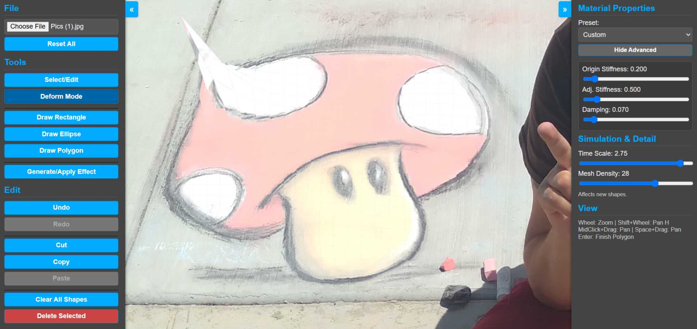

# DeformStudio 🎨

DeformStudio is a web-based 2D image deformation tool built entirely with vanilla HTML, CSS, and JavaScript. It allows you to load an image, draw various shapes (rectangles, ellipses, polygons) on it, and then deform these shapes using a physics-based mesh. You can apply different material properties to simulate effects like jelly, cloth, or rubber.

[DeformStudio](https://deformstudio.netlify.app/)

## 🌟 Features

*   **Image Loading:** Load your own images (PNG, JPG, etc.) as a base for deformation.
*   **Shape Drawing Tools:**
    *   Rectangle
    *   Ellipse
    *   Polygon (multi-point)
*   **Deformation Mode:**
    *   Select a shape and enter "Deform Mode" to interact with its physics mesh.
    *   Click and drag mesh points to deform the shape.
    *   The shape will realistically jiggle and settle based on its material properties.
*   **Material Properties:**
    *   Choose from presets like "Jelly (Firm/Medium/Loose)", "Cloth (Light/Heavy)", "Rubber Band", "Slime", "Water Surface".
    *   Fine-tune advanced parameters:
        *   **Origin Stiffness:** How strongly points try to return to their original position.
        *   **Adjacent Stiffness:** How strongly connected points try to maintain their relative distance.
        *   **Damping:** How quickly the motion dissipates.
*   **Simulation Controls:**
    *   **Time Scale:** Speed up or slow down the physics simulation.
    *   **Mesh Density:** Control the detail of the deformation mesh for newly created shapes.
*   **Basic Editing:**
    *   Undo/Redo actions.
    *   Cut/Copy/Paste shapes.
    *   Clear all shapes.
    *   Delete selected shape.
*   **View Controls:**
    *   Pan (Middle Mouse Button + Drag, Space + Drag, Shift + Wheel for horizontal).
    *   Zoom (Mouse Wheel).
*   **Effect Overlays:**
    *   Generate a sample SVG-based visual effect overlay on shapes.
    *   Control opacity of the effect.
    *   Remove applied effects.
*   **Responsive UI:**
    *   Collapsible left and right toolbars.
    *   Canvas adapts to window size.
*   **Single File Application:** Everything is contained within `index.html` - no external dependencies or build process required.

## 🚀 How to Use

1.  **Download:** Get the `index.html` file from this repository.
2.  **Open:** Open the `index.html` file in any modern web browser (Chrome, Firefox, Edge, Safari).
3.  **Load Image:** Click the "Browse..." button under "File" in the left toolbar to load an image.
4.  **Draw Shapes:**
    *   Select a drawing tool (Rectangle, Ellipse, Polygon) from the "Tools" section.
    *   Click and drag on the image to draw. For polygons, click to place points and press `Enter` to finish.
5.  **Deform Shapes:**
    *   Select the "Select/Edit" tool.
    *   Click on a shape to select it.
    *   Click "Deform Mode" in the "Tools" section.
    *   Click and drag points on the selected shape's mesh to deform it.
    *   Alternatively, with "Select/Edit" active, hold `Ctrl` (or `Cmd` on Mac) and drag points on a selected deformable shape.
6.  **Adjust Properties:** Use the right toolbar to change material properties, simulation speed, and mesh density for new shapes.

## 🛠️ Controls

**Mouse:**
*   **Left Click:** Select, activate tools.
*   **Left Click + Drag:**
    *   Draw shapes (when a draw tool is active).
    *   Move selected shapes (when "Select/Edit" tool is active).
    *   Resize selected shapes using handles (when "Select/Edit" tool is active).
    *   Deform mesh points (when "Deform Mode" is active, or `Ctrl/Cmd` + Drag in "Select/Edit" mode on a deformable shape).
*   **Middle Mouse Button + Drag:** Pan the canvas.
*   **Mouse Wheel:** Zoom in/out.
*   **Shift + Mouse Wheel:** Pan horizontally.
*   **Space + Drag:** Pan the canvas.

**Keyboard Shortcuts:**
*   `Ctrl/Cmd + Z`: Undo
*   `Ctrl/Cmd + Y`: Redo
*   `Ctrl/Cmd + X`: Cut selected shape
*   `Ctrl/Cmd + C`: Copy selected shape
*   `Ctrl/Cmd + V`: Paste shape
*   `Delete` / `Backspace`: Delete selected shape
*   `Enter`: Finish drawing a polygon
*   `Escape`:
    *   Cancel current drawing operation (rectangle, ellipse).
    *   Cancel polygon drawing.
    *   Deselect shape.
    *   Reset active deformation if a point is being dragged.
    *   Exit "Deform Mode" and return to "Select/Edit" mode.
*   `Spacebar` (hold): Temporarily enables panning mode.

## 💻 Technology Stack

*   **HTML5:** Structure
*   **CSS3:** Styling
*   **JavaScript (ES6+):** All application logic, physics simulation, and rendering.
    *   No external libraries or frameworks are used (pure Vanilla JS).

## 🏗️ Code Structure (Key JavaScript Classes)

*   `DeformableShapesApp`: The main application class that initializes and manages all components.
*   `Shape`: Represents individual drawable and deformable shapes, handles their mesh, texture, physics properties, and rendering.
*   `CanvasView`: Manages the HTML5 canvas, rendering loop, view transformations (pan, zoom).
*   `InputHandler`: Processes all mouse and keyboard inputs.
*   `ToolbarManager`: Manages UI elements in the toolbars and their interactions.
*   `HistoryManager`: Implements undo/redo functionality.
*   `ClipboardManager`: Handles cut, copy, and paste operations for shapes.
*   `DomHelper`: A utility class for easier DOM element access.
